# 多来源爬虫汇总
>此处以中美贸易战为要爬取的内容(共爬取数据约 15 万)

## 爬虫来源 1
>微信文章的爬取

爬取策略: 因为微信文章的爬取时,微信对于每一个 ip 都有爬取有限制
解决方案: 所以这里要用到代理池的方法,代理池是 Reidis 数据库中存储着大量的 IP地址以供当一个 ip 被封了的时候,我么通过在 Redis 中存储的 ip 来替换,如果替换成功,则继续爬取,如果替换失败,则再在 Redis 中寻找下一个 Redis 进行爬取.

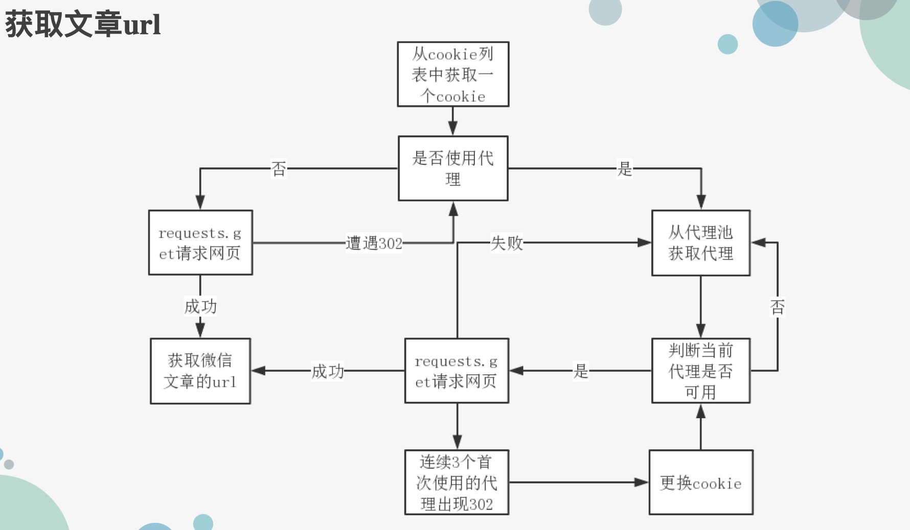
Redis 数据库代理池:
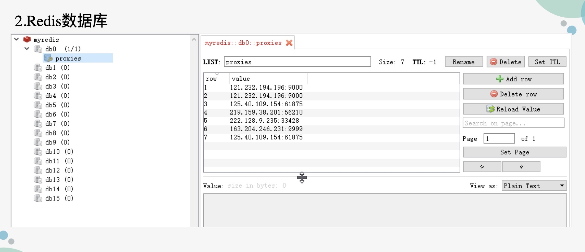

爬取结果:
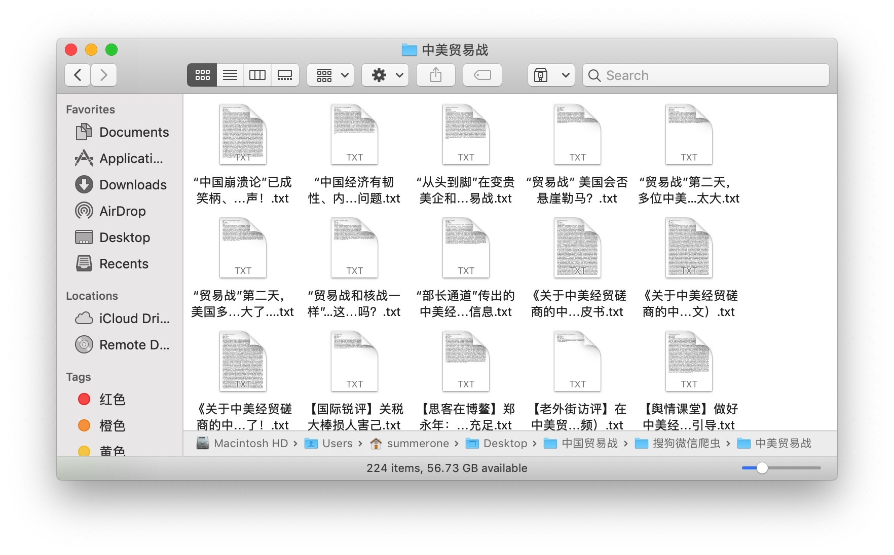

## 爬虫来源 2 
>中新网(爬取了 300 多篇)

爬取策略:
1. 首先通过爬取中新网主页面上关于中美贸易战的的所有新闻的 url
并存储在中新网.txt中
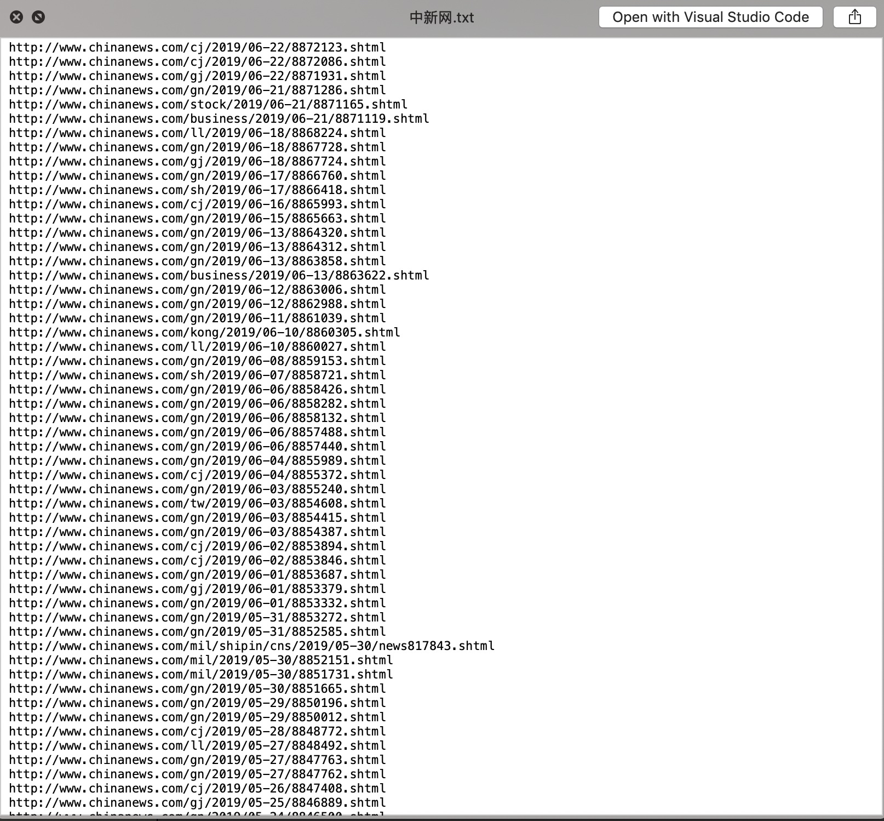
2. 然后对 txt 中每一个 url 进行爬取(详见中新网.py)
>其中出现的问题:爬取中新网不同网页的编码方式不同,所以爬到了很多的乱码
>解决方法:通过对不同编码方式的页面进行识别,观察到若是"gb2312"进行编码的网页,则会在网页中出现中文的"<--pc 和手机适配代码开始 -->",其余的网页都是 utf-8编码,所以在对网页的内容进行解析时,通过 beautifulsoup 匹配<!-- --!>中的内容,来判断篇新闻的内容
>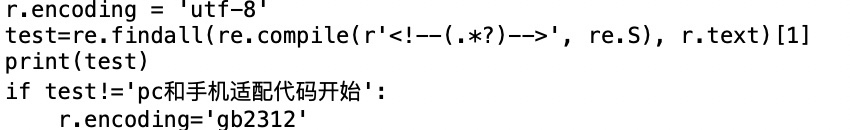

3. 爬取结果
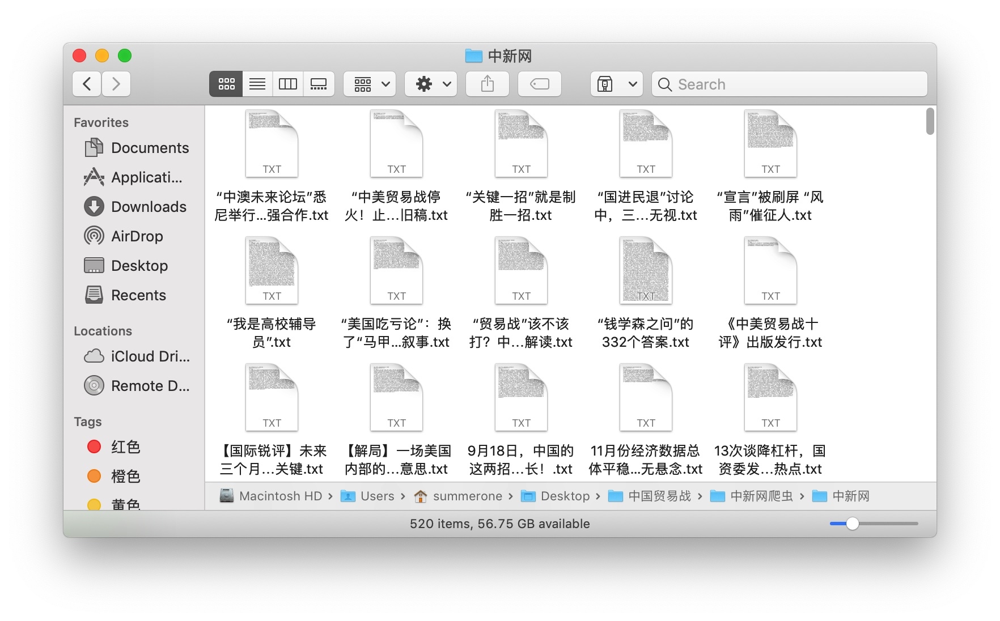

## 爬取来源 3
>新浪新闻(爬取接近 2 万条)

爬取策略与以上中新网相似,但是通过观察,我发现并不是所有的新闻都是我们所需要的,我们更加关心的是例如"市场影响","不可靠实体清单"这些比较敏感言论的新闻,所以在新浪新闻中我的爬取策略是对我所需要的有特殊言论的新闻进行爬取
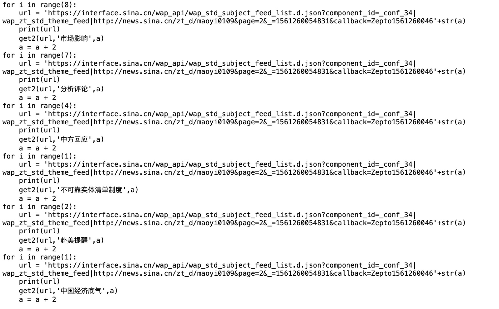
最终以 json 的格式进行存储
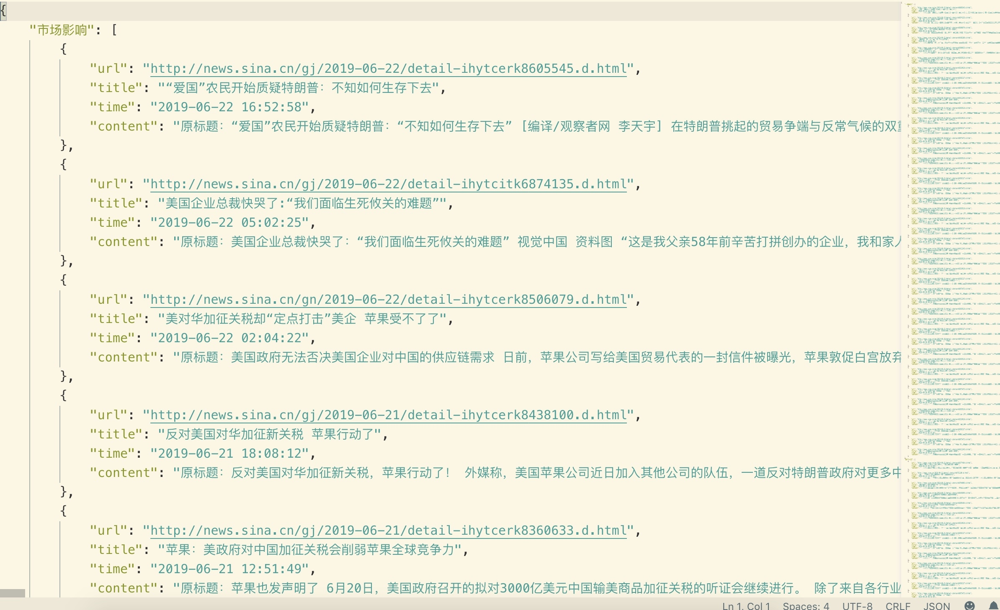
## 爬虫来源 4
>知乎的话题和评论

我们知道,知乎的结构和新闻是不同的,知乎是基于话题和评论的,而不是像新闻那样是是结构性的,所以我在对知乎进行爬取时,分别对关于中美贸易战的话题和问答进行爬取
文章内容存储:
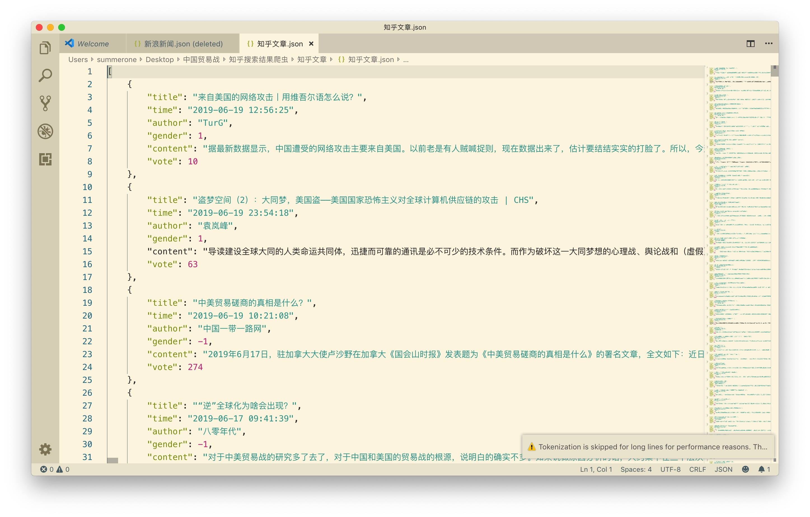
问答内容:
此处以"中国公告对美反倾销裁定"的问答为例
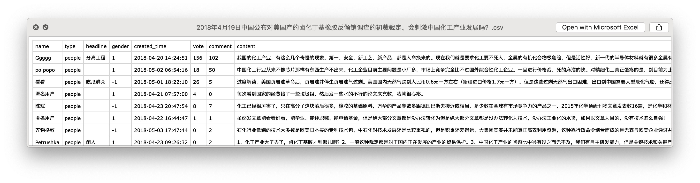
## 爬取来源 5
>百度新闻
爬取这个来源不太费力,利用 Selenium 来模拟浏览器来进行爬取就可以爬下来

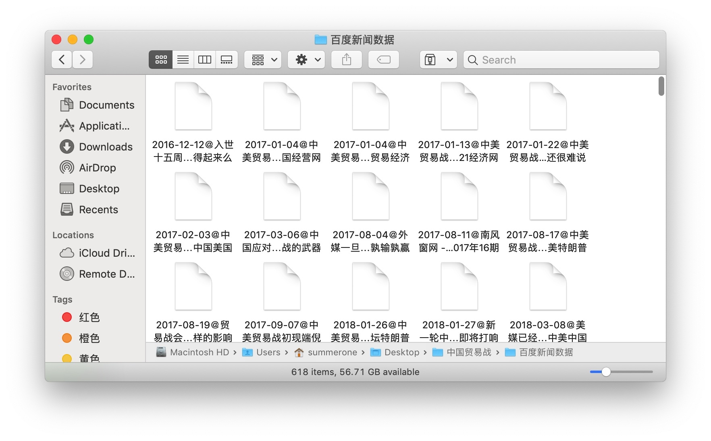

## 爬取来源 6
>今日头条

爬取今日头条时,因为是动态的网页,每次都在重定向.所以不能利用以前爬取静态网页的爬取策略,所以这里我们利用 Ajax 异步加载返回来的页面来进行 url 的爬取来获得对应文章的url,通过构造不同文章的 url 来爬取动态加载的网页
如图为构造网页 url 的过程,通过观察对应新闻的 url 来构造对应的 url 即可,但是今日头条的 url 有加密算法,但是网上都有相关的破解方法
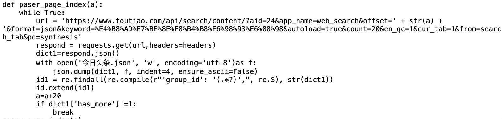
爬取结果:
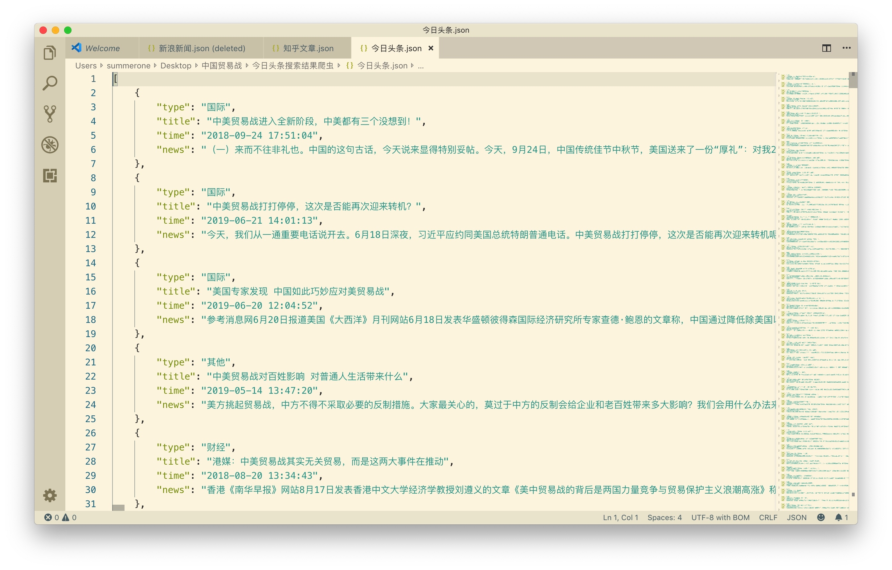

## 爬取来源 7
>twitter

这一部分我不是太熟,直接就是翻墙然后利用 Selenium 模拟浏览器进行强行的爬,爬的效率比较慢,但是为了体现数据的多元性,也爬了一点
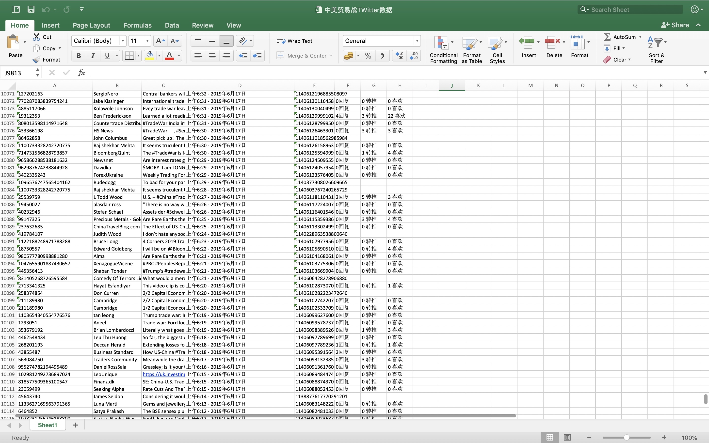

##爬取来源 8
>微博

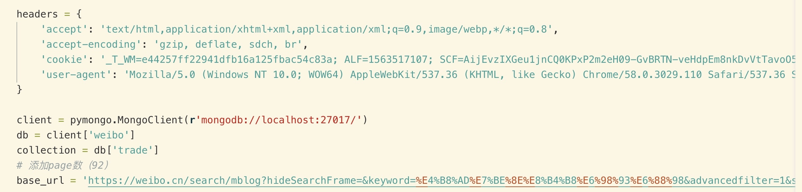
通过构造自己的头部,添加爬取相关爬取的参数,并利用 pyquery 进行解析爬取相关的网页,将爬取到的内容存到 MongoDB 中
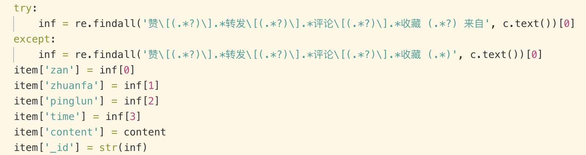
爬取对应的中美贸易战相关文章的**点赞,转发,评论,收藏,来自**的信息
##爬取来源 9
>搜狗新闻
这个比较好爬,没有什么反爬措施,直接进行构造爬取网页的页数,请求页面就可以了

